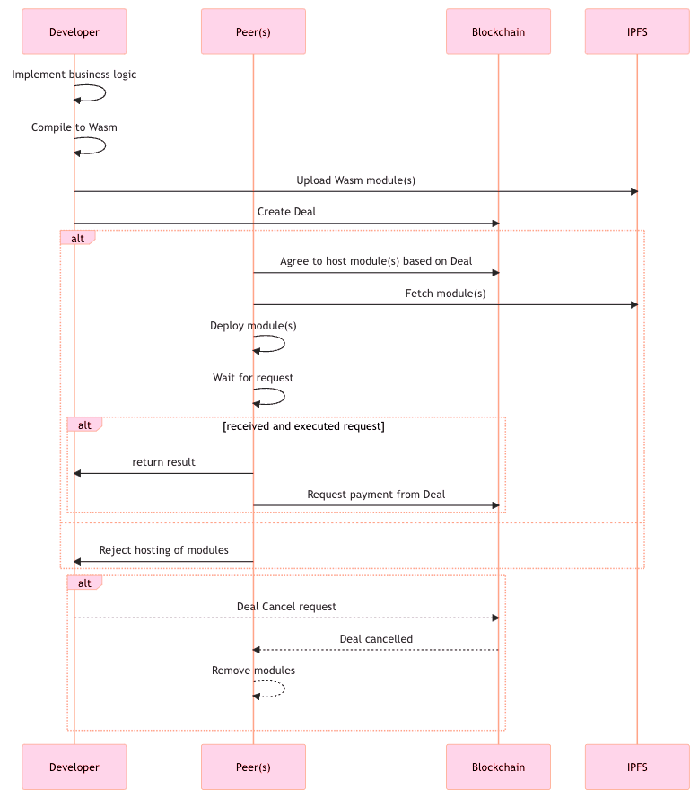

## Tutorial of developing dcloud dapps on fluence:

This is the test demo for the 

1. Aqua: DSL for developing the application in order to  deploy the distributed execution without centralized co-ordination.  they are not running in the backend as the contenarized applications. 

2. Marine: its the sdk written in rus, which defines the internal runti;e enviornment which will be executing the operations . thus all the microservices that needed to deploy (for instance ML model or the web app) will be defined  via modules which are then added in the `fluence.yaml` file. this will be included in the modules defined in the given package, each of them defining as the different "microservices" in the given deployment computation. 

## workflow for the lifecycle of the deal: 

</img>

## Tasks TBD: 

1. First completing the demo by resolving the issue of `@fluencelabs/deal-aurora`. 
2. deploy a full web app on the rust for example (using dioxus).
3. see whether we can deploy other runtimes (for instance python / TS ones) and implement them
4. Define a TS pakcage that can parse the deployment scripts , show a dahsboard (like grafana) about the status of deployment.
